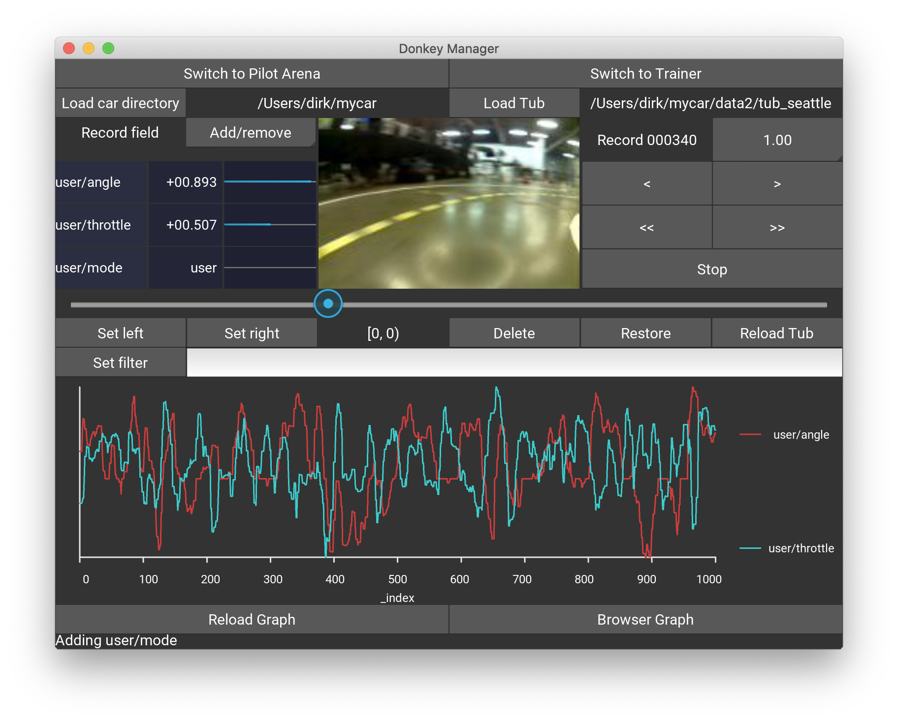

# Donkey UI

The Donkey UI currently contains three tabs supporting corresponding workflows:
1. The tub manager - this is a replacement for the web-based application launched through `donkey tubclean`
   
1. The trainer - this is a UI based alternative to train the pilot. Note, for longer tranings containing larger tubs or batches it is recommended to perform these in the shell using the `donkey train` command. The UI based training is geared towards experimenting and a rapid analysis cycle consisting of:
     * data manipulation / selection
     * training
     * pilot benchmarking

1. The pilot arena: here you can test two pilots against each other.

## The tub manager


In the tub manager screen you have to select the car directory that contains the config file `config.py` first, using the `Load car directory` button. Then select the tub you want to be working with using `Load tub`, the tub needs to be inside the car directory.

The drop-down menu `Add/remove' in the data panel to the left of the image allows to select the record fields, like `user/angle`, `user/throttle`, etc. 

**Note:** if your tub contains more data than the standard `user/angle`, `user/throttle` and you want the progress bars to correctly show the values of these fiels, you need to an entry into the `.donkeyrc` file in your home directory. This file is automatically created by the Donkey UI app. Here is an example:
```yaml
field_mapping:
- centered: true
  field: car/accel
  max_value_id: IMU_ACCEL_NORM
```
This data contains the name of the tub field, if the data is centered around 0 and the name of the maximum value of that data field which has to be provided in the `myconfig.py` file. For example, the data above represents the IMU acceleration of the IMU6050 which ranges between +/- 2g, i.e. ~ +/- 20 m/s^2. So with an IMU_ACCEL_NORM = 20 the bar can display these values.

To delete unwanted records press `Set left` / `Set right` buttons to determine the range and hit `Delete` to remove such records from training. To see the impact on the current tub press `Reload tub`. If you want to resurrect accidentally deleted records, just choose a left/right value outside the deleted range and press `Restore`.

**Note:** The left/right values are invertable, i.e. left > right operates on all records outside of [left, right).

In the filter section you can suppress records, say you want to restrict the next training on only right curves, then add `user/angle > 0` to select those records.
**Note:** the filter on only for display in the tub manager. If you want to apply this in training you have to write the predicate as explained in [utility](../utility/donkey.md)

